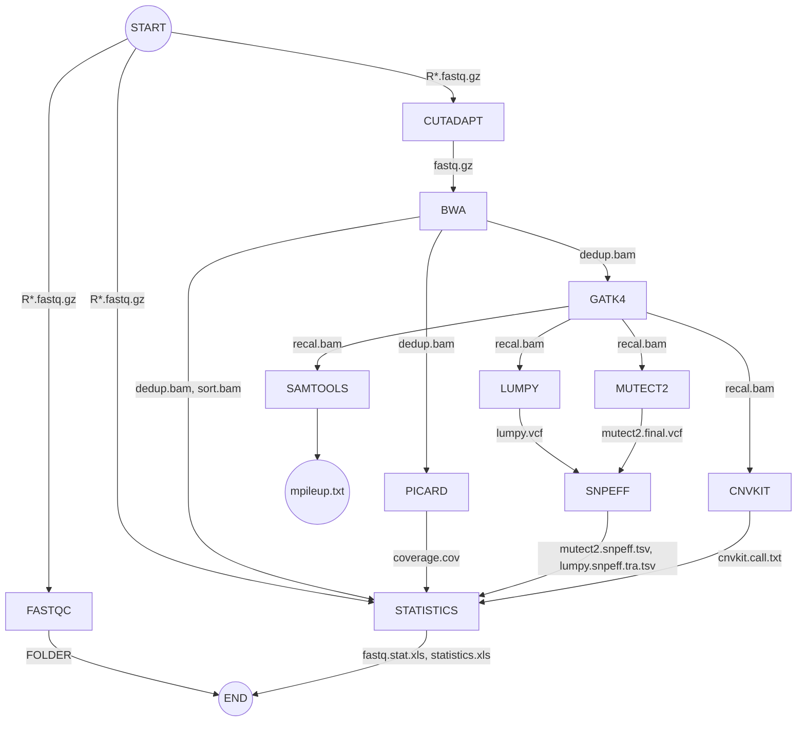

# 데이터 레이크 구축
- 기간: 2021.05 ~ 현재 진행 중
- 참여: 데이터 레이크, 데이터 웨어하우스, 데이터 마트 구축에서부터 BI 툴로 분석/시각화하는 것까지의 일련의 과정 진행 중
- 스택: AWS, Glue, S3, Java, Sprint-boot, JavaScript
- 설명: 
	- 각 부서들 요구사항 수집/정리, 데이터베이스 표준화, 카탈로그 생성, BI 툴 연결, 기계학습을 통한 분석 및 모델+데이터 유지관리 계획 담당
	- 다양한 종류의 파일 (png, pdf, csv 등) 저장하기 위한 저장소 구축과 저장소로 데이터를 업로드 하는 웹 툴 개발 관리/감독(스프링부트 이용)


# Pipelines

**Updated: 2022-04-04**
> This document describes how to run WES pipelines in your project folder. 

## Components
- FASTQC
- CUTADAPT
- BWA
- GATK4
- PICARD
- MUTECT2
- SAMTOOLS
- CNVKIT
- STATISTICS
- LUMPY
- SNPEFF

## Flow chart



## Environment setup
Python 3.x should be installed prior to your environment setup, and **conda** command from your *miniconda3* folder should be included in your **$PATH** variable.
```
export PATH=$PATH:/TBI/People/tbi/{your-name}/miniconda3/bin/	# optional
```

